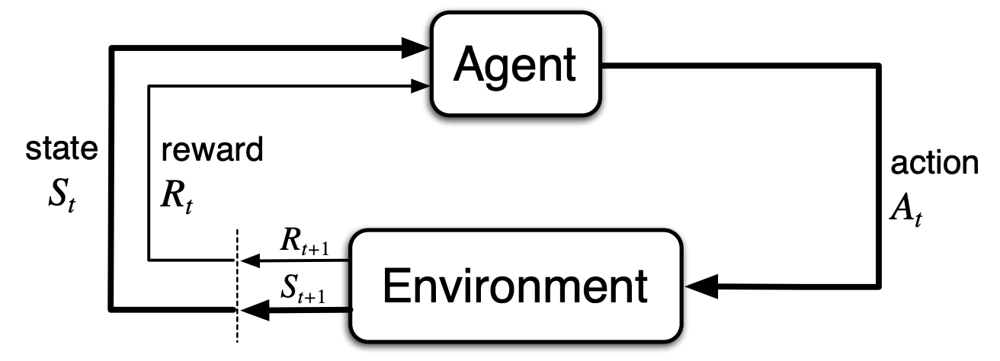

<link href="https://fonts.googleapis.com/icon?family=Material+Icons" rel="stylesheet">
<link href="policy-evaluation-demo.css" rel="stylesheet"></link>

Learning by interacting with an environment is how people and animals learns.
A computer or an agent can also learn the same way.  

<!--more--> 

Reinforcement learning is focused on goal-directed learning from interaction 
and is composed by four components : a policy, a reward, a value function and optionally model.

# Environments

Before doing some learning on our environment, 
it's required to first define and describe the environment.  

When facing an environment there is a possibility to choose among $n$ actions called the _action space_.
After each chosen action, a numerical _reward_ $r$ is received and a new action choice is possible.
The objective is to maximize the total rewards over some time period 
consisting of $t$ actions or _time steps_.  

## Model

The model is the representation of the environment. 
For an environment, it gives the probability of future states given an action.

## Stationary problems

The simplest problems that can be learned are the stationary problems. 
That is, when the reward probability after each actions do not change at each _time step_.

The standard example of this is the [_k-armed bandit_](https://en.wikipedia.org/wiki/Multi-armed_bandit) problem.

### Action value

The goal of the agent is trying to maximize the sum of received rewards by choosing the best actions.
The _action value_ $Q_n$ is the estimate of the expected future received rewards at step $n$
after choosing an action $a_n$ and receiving the reward $R_n$ and can be computed by:

$$Q_n(a) = Q_n(a) + \frac 1n [R_n - Q_n(a)]$$

This method update the new estimate $Q_n(a)$ to reduce the difference
 $R_n - Q_n(a)$ by a small step-size $\alpha = \frac 1n$. The difference represent the error
 of our estimate $Q_n(a)$ that we try to minimize.

## Non-Stationary problems

Environment are almost never stationary because the reward probability is changing over time.
In such cases it makes sense to give more weight to recent rewards than to long-past rewards.
One way of doing this is to use a constant step-size:

$$Q(a) = Q(a) + \alpha [R - Q(a)] \text{, with } \alpha \in (0, 1]$$

## Contextual problems

The two previous problems are nonassociative : there is only single situation, or state,
for action selection. Most of the time, an environment has more than one state and actions 
need to be chosen based on the current situation.  
The agent have to learn the mapping from states to the actions 
that are the best in those states : the policy $\pi$.

# Markov Decision Processes

Markov Decision Processes (or MDP) are the mathematical representation of 
the reinforcement learning problems or environments. 
This formalize the learning component as the _agent_ interacting with an _environment_ in
a sequence of discrete time steps, $t = 0, 1, 2, 3, \ldots$. At each time step $t$,
the agent receive the environment _state_, $S_t \in \mathcal S$ and select an _action_,
$A_t \in \mathcal A(s)$. One time step later, the agent recieve a numerical _reward_,
$R_{t+1} \in \mathcal R \subset \mathbb R$ with a new _state_ $S_{t+1}$.

## Trajectory

The trajectory is the sequence of state, action and rewards like this :

$$S_0, A_0, R_1, S_1, A_1, R_2, S_2, A_2, R_3, \ldots$$

## Return

The return is the sum of rewards and is defined as:

$$\mathit G_t \dot= R_{t+1} + \gamma R_{t+2} + \gamma^2 R_{t+3} + \cdots + R_{T}$$

This approach is valid only for tasks with an actual _terminal state_ $T$, called _episodic tasks_.

## Discounted return

In case of _continuing task_ (i.e. $T = \infty$) the return $G_t$ could be infinite.
To make the return finite, we introduce a discount factor $\gamma$ and defining the discounted return:

$$\begin{aligned}
G_t &\dot= R_{t+1} + \gamma R_{t+2} + \gamma^2 R_{t+3} + \cdots \\
    &\dot= \sum_{k=0}^\infty \gamma^k R_{t+k+1}
\end{aligned}$$

The return can be slightly modified to take into account both _continuing tasks_ and _episodic tasks_:

$$G_t \dot= \sum_{k=t+1}^T \gamma^{k-t-1} R_k \\
\text{with $\mathit T = \infty$ or $\gamma = 1$ but not both.}
$$

## Policy

A _policy_ is a mapping from states to probability of selecting each possible action. 
We denote $\pi(a|s)$ the probability that $A_t = a \text{ if } S_t = s$ 
while following _policy_ $\pi$ at time $t$.

## Value functions

The value $v$ represent the total amount of rewards an agent can expect to received in the future.
The reward is immediate but the value is the expected sum of future rewards.

### State-Value function

The _state-value function_ of a state $s$ under policy $\pi$, 
denoted $v_\pi(s)$, is the expected return when starting in $s$ and following $\pi$ thereafter:

$$v_{\pi}(s) \dot= \mathbb E_{\pi}[G_t | S_t = s]$$

The _optimal state-value function_, denoted $v_*(s)$ defined as:

$$v_*(s) \dot= \max_\pi v_\pi(s) \text{ , for all } s \in \mathcal S$$

### Action-Value function

The _action-value function_ of taking action $a$ in state $s$ under policy $\pi$,
denoted $q_\pi(s, a)$, is the expected return when starting from $s$, taking the action $a$, 
and following policy $\pi$ thereafter:

$$q_{\pi}(s,a) \dot= \mathbb E_{\pi}[G_t | S_t = s, A_t = a]$$

The _optimal action-value function_, denoted $v_*(s)$ defined as:

$$q_*(s, a) \dot= \max_\pi q_\pi(s, a) \text{ , for all } s \in \mathcal S$$

### Optimal policy

The optimal state-value function or optimal action-value function
are found for at least one policy called the _optimal policy_ and denoted $\pi_*$.

